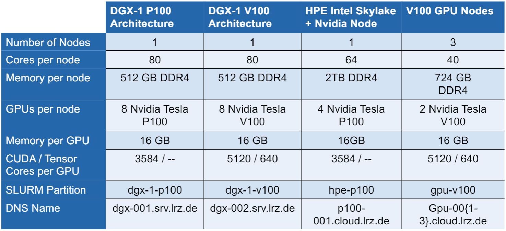

# Geometrical Deep Learning on 3D Models: <br> Classification for Additive Manufacturing
### TUM Data Innovation Lab in cooperation with VW Data:Lab | Summer 2021

---
## Table of Content

- [`1. Repositroy Structure`](#1-repository-structure)
- [`2. Problem understanding`](#2-project-outline)
    - [`2.1 Background`](#21-business-background)
    - [`2.2 Target/Goal`](#22-target)
    - [`2.3 Boundaries`](#23-business-boundaries)
- [`3. Data understanding`](#3-data-understanding)
    - [`3.1 Data Source`](#31-data-source)
    - [`3.2 Data Model`](#32-data-model)
    - [`3.3 Data Description/Exploration`](#23-data-descriptionexploration)
    - [`3.4 Data Cleaning/Selection`](#34-data-cleaning-selection)
    - [`3.5 Data Quality/Verification`](#data-quality-verification)
- [`4. Requirements`](#4-requirements)
    - [`4.1 Data`](#41-data)
    - [`4.2 Infrastructure`](#42-infrastructure)
    - [`4.3 Libraries`](#43-libraries)
- [`5. LRZ AI System`](#5-lrz-ai-system)
    - [`5.1 General User Instructions`](#51-general-user-instructions)
    - [`5.2 Login`](#52-login)
    - [`5.3 Available GPU Instances`](#53-available-gpu-instances)
    - [`5.4 SLURM Commands`](#54-slurm-commands)
    - [`5.5 Containerized Software Stack`](#55-containerized-software-stack)
    - [`5.6 Data Storage Limitations`](#56-data-storage-limitations)
    - [`5.7 Submitting Jobs into SLURM`](#57-submitting-jobs-into-slurm)
    - [`5.8 MLflow UI on local browser`](#58-mlflow-ui-on-local-browser)
- [`6. Model`](#6-model)
    - [`6.1 Model Selection`](#61-model-selection)
    - [`6.2 Modelling`](#62-modelling)
    - [`6.3 Hyperparameter`](#63-hyperparameter)
    - [`6.4 Model Understanding / Explainability`](#64-model-understanding--explainability)
    - [`6.5 Result Reproducibility`](#65-result-reproducibility)
    - [`6.6 Model Stability`](#66-model-stability)
    - [`6.7 Model Limitations`](#67-model-limitations)
    - [`6.8 Model Operation`](#68-model-operation)
- [`7. Results`](#7-results)
- [`8. Evaluation`](#8-evaluation)

- [`Glossary`](#glossary)

- [`Contributors`](#contributors)

--- 

## 1. Repository Structure
- [`data`](/data): Contains some sample data
- [`dev_notebooks`](/dev_notebooks): Contains all Jupyter notebook files which are used for rapid prototyping
- [`doc`](/doc): Contains diverse documentation files
- [`infra`](/infra): Contains all files which are used in order to create the environment for training deep learning models on the LRZ AI System
- [`src`](/src): Contains all python source files of the project
- [`tests`](/tests): Contains all test files in order to perform unit testing

---

## 2. Problem understanding

### 2.1 Background

The overall goal of this project is about developing an algorithm using deep learning, which is capable of predicting whether a 3D-model is printable or not. In this context, printable refers to the context of additive manufacturing. 

### 2.2 Target    

- Goal Definition
- Goal Measurment

### 2.3 Boundaries

- How is the algorithm going to be consumed in the end?
- Technical requirements (Expected Results, Cosntraints)?

---

## 3. Data understanding

### 3.1 Data Source

In a first step, public available datasets (i.e. open source data) are used. To be specific, the following to ressources are considered as the main source:

- [Thingi10K](https://ten-thousand-models.appspot.com/results.html?q=genus%3D0)
- [ABC Dataset](https://deep-geometry.github.io/abc-dataset/)

### 3.2 Data Model

- Describe the ETL (Extract, Transform, Load)

### 3.3 Data Description/Exploration

- Describe result of the Data Exploration
    - What kind of data?
    - Which range?
    - Sample Data

### 3.4 Data Cleaning/Selection

- How is the data cleaned? 
- Is all data used in the end?


### 3.5 Data Quality/Verification

- Does the Data match the requirements (from problem description)?

---

## 4. Requirements

### 4.1 Data
- Thingi10K
- ABC Dataset

### 4.2 Infrastructure
- LRZ AI System
- Docker 
- Enroot

For elaborate information about the infrastruture and how to use it, please consult section about [`LRZ AI System`](#5-lrz-ai-system) .

### 4.3 Libraries
- PyTorch
- Numpy
- Matplotlib

---

## 5. LRZ AI System

### 5.1 General User Instructions

- Request only the number of GPUs you are using (i.e. do not allocate more than 1 GPU if you are not performing parallel training using horovod) 

- If your training has not mix precision enabled, please select only these resources with P100 cards 

- The time limit is restricted to max. 24 hours, so if the job is running longer that the available time slot, save checkpoints frequently

### 5.2 Login

First, make sure that you've established a VPN tunnel to the LRZ. This can be done using any VPN client (e.g. Cisco AnyConnect) and providing the domain `https://asa-cluster.lrz.de/` once you're asked for that. Afterwards, use your TUM credentials to login. <br>

Once the VPN connection is established successfully, use SSH in order to login to the AI-System. 

```console
$ ssh username@datalab2.srv.lrz.de
```

### 5.3 Available GPU Instances

A overview of the available GPU instances within the LRZ AI System is given below: 

<h2 align="center">
  
</h2>

One of the most important information provided by the table above is the "SLURM Partition" as this information is needed in order to submit the job to the desired machine. 

### 5.4 SLURM Commands

This section is about providing some useful commands in order to use SLURM on the AI System. 

```console
Show all available queues
$ sinfo 

Show reservation of queus (if there is any)
$ squeue

Create allocation of ressources
$ salloc 
Example:
$ salloc -p dgx-1-p100 --ntasks=8 --gres=gpu:8

Cancel allocation of ressources
$ scancel <JobID>

Run job
$ srun
Example:
$ srun --pty enroot start --mount ./data:/mnt/data ubuntu.sqush bash

Submit batch job into SLURM pipeline
$ sbatch
Example:
$ sbatch script.sbatch
```

### 5.5 Containerized Software Stack

The LRZ AI System is a container based solution. This means, in order to make use of any GPU instance, we have to first deploy a container on the AI System from which a SLURM job can be submitted. <br>

To this end, `enroot` container runtime is used, in order to deploy a conatainer on the LRZ AI System, as users are not granted root access to the file system. In contrast to `Docker`, using `enroot` means we are able to start a rootless container, wherein we have root permissions, but not outside of it. <br>

The following steps show how to deploy a container on the LRZ AI System:

1. Import a container from a repository (e.g. Docker Hub)

```console
$ enroot import docker://ubuntu
```

The result of this step is an image which is called "ubuntu.sqsh". 

2. Start an enroot container using the recently created image

```console
$ enroot start ubuntu.sqsh
```

### 5.6 Data Storage Limitations

The current data storage within the LRZ AI System is resticted to the following properties:

- Disk quota: 150 GB
- File quota: 200.000

If this needs to be enlarged, a service request has to be created at the LRZ service desk. 

### 5.7 Submitting Jobs into SLURM

Generally, there are two different ways in submitting jobs to the SLURM pipeine:

1. Interactive Jobs (i.e. interact with the terminal)
2. Batch Jobs (i.e. no interaction with the terminal)

**Interactive Jobs**
Using this option enables to get a console output of the job which is submitted to the SLURM pipeline. For example, if we submit a job which is about training a Neural Network, we would see the training progress in the CLI. This is basically done by fist allocating a ressource followed by submitting a containerized job (for help, see SLURM commands section above).

**Batch Jobs**
Using this option does not provide a console output. However, within the .sbatch script it can be declared where to write the output and errors. A sample script is provided below:

```console
#!/bin/bash
#SBATCH -N 1
#SBATCH -p dgx
#SBATCH --gres=gpu:8
#SBATCH --ntasks=8
#SBATCH -o enroot_test.out
#SBATCH -e enroot_test.err

srun --container-mounts=./data-test:/mnt/data-test --container-image='horovod/horovod+0.16.4-tf1.12.0-torch1.1.0-mxnet1.4.1-py3.5' \
python script.py --epochs 55 --batch-size 512
```

### 5.8 MLflow UI on local Browser

Once the deep learning container has been started on the LRZ AI system, you'll get a similar output to the one which is presented right below (please be patient, this might take some seconds):

```console
Cloning into 'TUM-DI-LAB'...
remote: Enumerating objects: 3151, done.
remote: Counting objects: 100% (233/233), done.
remote: Compressing objects: 100% (172/172), done.
remote: Total 3151 (delta 122), reused 135 (delta 61), pack-reused 2918
Receiving objects: 100% (3151/3151), 108.13 MiB | 6.50 MiB/s, done.
Resolving deltas: 100% (2100/2100), done.
Updating files: 100% (145/145), done.
Branch 'dev' set up to track remote branch 'dev' from 'origin'.
Switched to a new branch 'dev'
entrypoint.sh: line 9: cd: /workspace/mount_dir/: No such file or directory
root@9fdaa7f9b957:/workspace# [2021-06-23 09:06:13 +0000] [339] [INFO] Starting gunicorn 20.1.0
[2021-06-23 09:06:13 +0000] [339] [INFO] Listening at: http://0.0.0.0:5000 (339)
[2021-06-23 09:06:13 +0000] [339] [INFO] Using worker: sync
[2021-06-23 09:06:13 +0000] [341] [INFO] Booting worker with pid: 341
```

Things which are happening here are:
- The latest version of the TUM-DI-LAB github repository gets cloned into the container
- The working branch is changed to dev
- The MLflow UI gets started as a background process (please do not kill this job, otherwise UI is not accessible anymore)

`After you are facing a similar output as shown above, please hit ENTER, in ordert to get to the well known bash CLI.`

From there on, please follow the corresponding steps in order to open the MLflow UI on your local web browser:
1. Get to know the ip-address of the machine you are working on. Therefore execute the follwoing command:
```console
$ ifconfig
```
`Please look for the ip-adress which starts with 10.XXX.XXX.XXX`

2. Start a web browser on your local machine and open the socket comprised of the ip-adress and the port 5000. A respective example can be found below:
```
http://10.195.15.242:5000/
```


---

## Glossary

Define most important terms and expressions. 

|Term|Definition|
|----|----------|
|NN|Neural Network|
|CLI|Command Line Interface|

---

## Contributors

| Name                                | E-Mail                                 |
| ----------------------------------- | -------------------------------- |
| Bouziane, Nouhayla                  | nouhayla.bouziane@tum.de         |
| Ebid, Ahmed                         | ahmed.ebid@tum.de                |
| Srinivas, Aditya                    | aditya.srinivas@tum.de           |
| Bok, Felix                          | felix.bok@tum.de                 |
| Kiechle, Johannes                   | johannes.kiechle@tum.de          |
| Lux, Kerstin (Supervisor TUM)       | kerstin.lux@tum.de               |
| Cesur, Guelce (Supervisor VW)       | guelce.cesur1@volkswagen.de      |
| Kleshchonok, Andrii (Supervisor VW) | andrii.kleshchonok@volkswagen.de |
| Danielz, Marcus (Supervisor VW)     | marcus.danielz1@volkswagen.de    |
